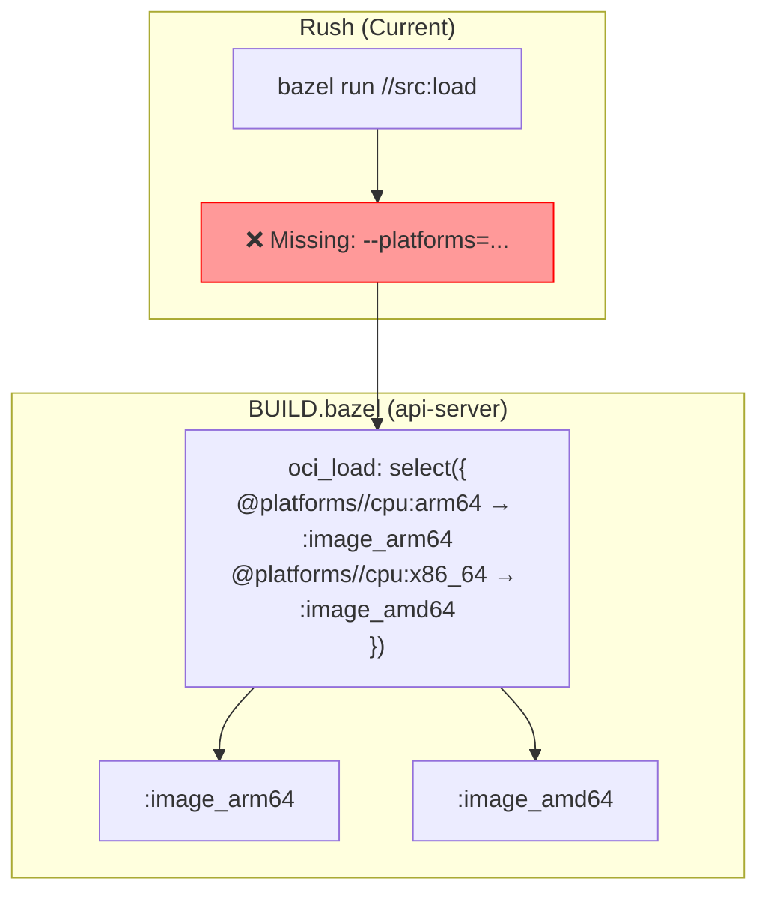
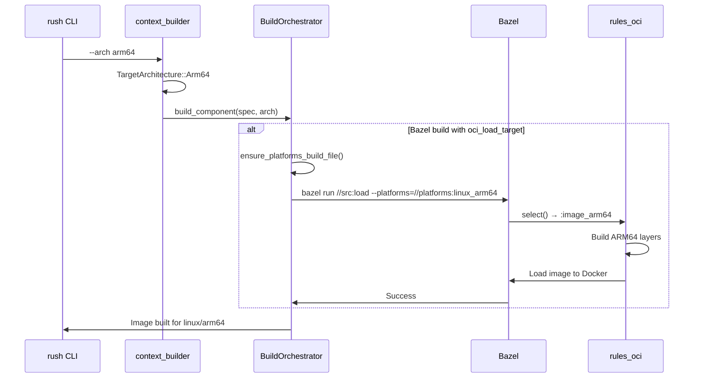

# Plan: Target Architecture Control for Bazel OCI Images

## Problem Statement

**All Docker images MUST be built using Bazel OCI (`rules_oci`), NOT Docker.**

Currently:
1. The `--arch` flag exists but is only partially propagated
2. Bazel OCI builds via `run_bazel_oci_load()` do NOT pass `--platforms=` flag
3. Bazel defaults to host architecture, ignoring user's architecture preference
4. The `select()` in BUILD.bazel relies on `--platforms=` to choose the correct image variant

## Current Architecture



## Solution Overview

Pass `--platforms=` flag to Bazel when running `oci_load` targets:

```mermaid
graph TB
    subgraph "CLI"
        CLI["rush --arch arm64 helloworld.wonop.io dev"]
    end
    
    subgraph "Rush"
        TARGET_ARCH["TargetArchitecture::Arm64"]
        BAZEL_CMD["bazel run //src:load<br/>--platforms=//platforms:linux_arm64"]
        CLI --> TARGET_ARCH
        TARGET_ARCH --> BAZEL_CMD
    end
    
    subgraph "BUILD.bazel"
        SELECT["select() chooses :image_arm64"]
        BAZEL_CMD --> SELECT
    end
    
    style TARGET_ARCH fill:#9f9,stroke:#0f0
    style BAZEL_CMD fill:#9f9,stroke:#0f0
```

## Required Changes

### Phase 1: Add Platform Definitions (Bazel)

Each Bazel workspace needs platform definitions. We can either:

**Option A: Define in each workspace**
```starlark
# platforms/BUILD.bazel
platform(
    name = "linux_amd64",
    constraint_values = [
        "@platforms//os:linux",
        "@platforms//cpu:x86_64",
    ],
)

platform(
    name = "linux_arm64",
    constraint_values = [
        "@platforms//os:linux",
        "@platforms//cpu:arm64",
    ],
)
```

**Option B: Auto-generate when running Bazel (Rush responsibility)**

### Phase 2: Update `TargetArchitecture` (Rust)

**File: `rush-core/src/types.rs`**

Add method to convert to Bazel platform:
```rust
impl TargetArchitecture {
    /// Returns the Bazel --platforms flag value
    pub fn to_bazel_platform(&self) -> Option<String> {
        match self {
            TargetArchitecture::Native => None, // Let Bazel use host
            TargetArchitecture::Amd64 => Some("//platforms:linux_amd64".to_string()),
            TargetArchitecture::Arm64 => Some("//platforms:linux_arm64".to_string()),
        }
    }
}
```

### Phase 3: Update `run_bazel_oci_load` (Rust)

**File: `rush-container/src/build/orchestrator.rs`**

Current signature:
```rust
async fn run_bazel_oci_load(
    &self,
    workspace_path: &Path,
    oci_load_target: &str,
    expected_image_name: &str,
    additional_args: Option<&Vec<String>>,
) -> Result<()>
```

Updated signature:
```rust
async fn run_bazel_oci_load(
    &self,
    workspace_path: &Path,
    oci_load_target: &str,
    expected_image_name: &str,
    additional_args: Option<&Vec<String>>,
    target_platform: Option<&str>, // NEW
) -> Result<()>
```

Updated implementation:
```rust
let mut args = vec!["run".to_string()];
args.push(oci_load_target.to_string());
args.push("--compilation_mode=opt".to_string());

// Add platform flag for cross-compilation
if let Some(platform) = target_platform {
    args.push(format!("--platforms={}", platform));
}
```

### Phase 4: Ensure Platform Definitions Exist

**File: `rush-container/src/build/orchestrator.rs`**

Add helper to create platforms/BUILD.bazel if missing:
```rust
async fn ensure_platforms_build_file(workspace_path: &Path) -> Result<()> {
    let platforms_dir = workspace_path.join("platforms");
    let build_file = platforms_dir.join("BUILD.bazel");
    
    if !build_file.exists() {
        tokio::fs::create_dir_all(&platforms_dir).await?;
        tokio::fs::write(&build_file, PLATFORMS_BUILD_CONTENT).await?;
    }
    
    Ok(())
}

const PLATFORMS_BUILD_CONTENT: &str = r#"
package(default_visibility = ["//visibility:public"])

platform(
    name = "linux_amd64",
    constraint_values = [
        "@platforms//os:linux",
        "@platforms//cpu:x86_64",
    ],
)

platform(
    name = "linux_arm64", 
    constraint_values = [
        "@platforms//os:linux",
        "@platforms//cpu:arm64",
    ],
)
"#;
```

### Phase 5: Thread Architecture Through Build Pipeline

**File: `rush-container/src/build/orchestrator.rs`**

Update `build_component()` to accept and pass target architecture:
```rust
pub async fn build_component(
    &self,
    spec: &ComponentBuildSpec,
    force_rebuild: bool,
    target_arch: &TargetArchitecture, // NEW
) -> Result<()>
```

In the Bazel branch:
```rust
BuildType::Bazel { oci_load_target, .. } => {
    if let Some(load_target) = oci_load_target {
        self.ensure_platforms_build_file(&workspace_path).await?;
        
        let bazel_platform = target_arch.to_bazel_platform();
        self.run_bazel_oci_load(
            &workspace_path,
            load_target,
            &expected_image_name,
            additional_args.as_ref(),
            bazel_platform.as_deref(), // NEW
        ).await?;
    }
}
```

## Files to Modify

| File | Change |
|------|--------|
| `rush-core/src/types.rs` | Add `to_bazel_platform()` method |
| `rush-container/src/build/orchestrator.rs` | Update `run_bazel_oci_load()`, add `ensure_platforms_build_file()`, thread architecture |
| `rush-cli/src/context_builder.rs` | Pass `target_arch` to build operations |

## Architecture Flow (After Changes)



## Usage

```bash
# Default: Native (host architecture)
rush helloworld.wonop.io dev

# Explicit ARM64
rush --arch arm64 helloworld.wonop.io dev
# Bazel runs with: --platforms=//platforms:linux_arm64

# Explicit AMD64
rush --arch amd64 helloworld.wonop.io dev  
# Bazel runs with: --platforms=//platforms:linux_amd64
```

## Status

- [ ] Phase 1: Platform definitions (auto-generated by Rush)
- [ ] Phase 2: `TargetArchitecture::to_bazel_platform()`
- [ ] Phase 3: Update `run_bazel_oci_load()` 
- [ ] Phase 4: `ensure_platforms_build_file()` helper
- [ ] Phase 5: Thread architecture through build pipeline
- [ ] Testing: Verify cross-compilation works

## Notes

- Docker is only used for **running containers locally**, not building images
- All image builds go through Bazel OCI (`rules_oci`)
- The `select()` in BUILD.bazel depends on `--platforms=` to choose architecture
- Platform definitions are auto-generated by Rush if missing
