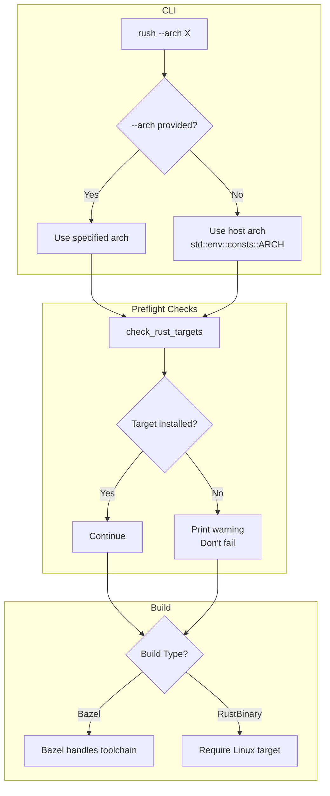
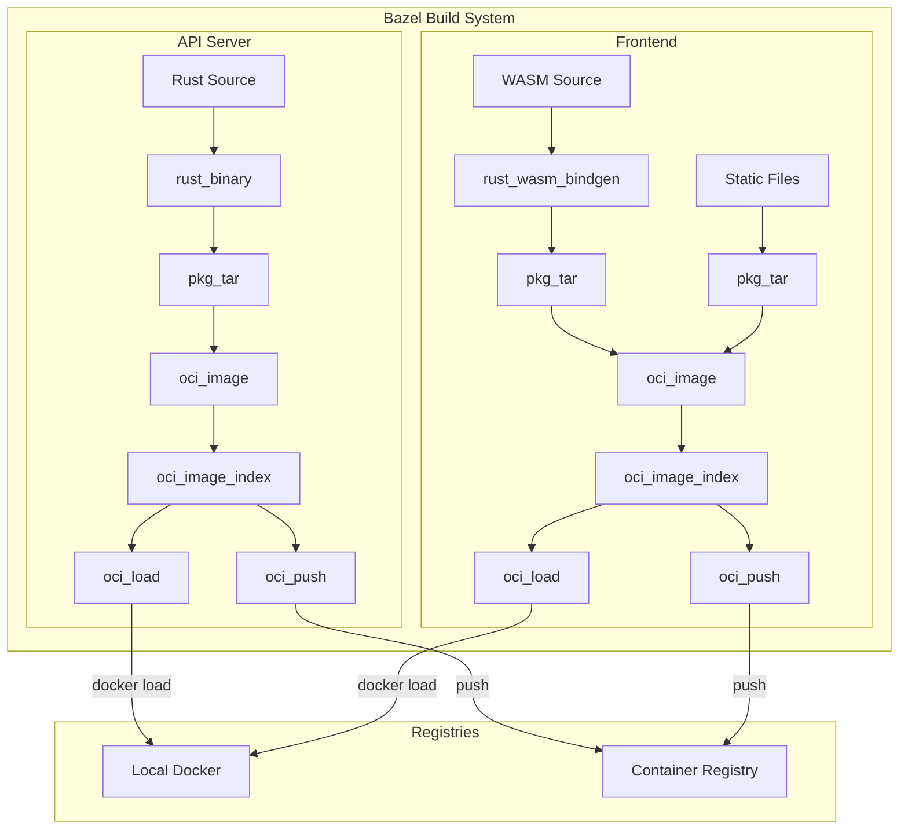
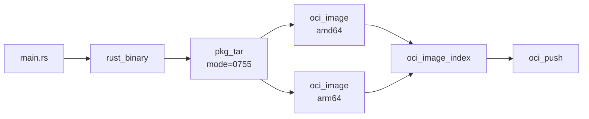
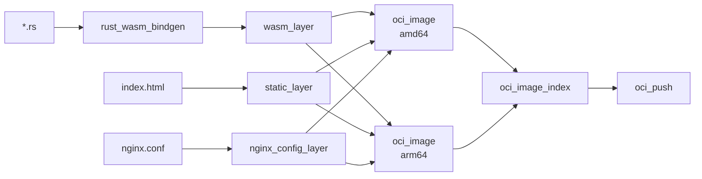
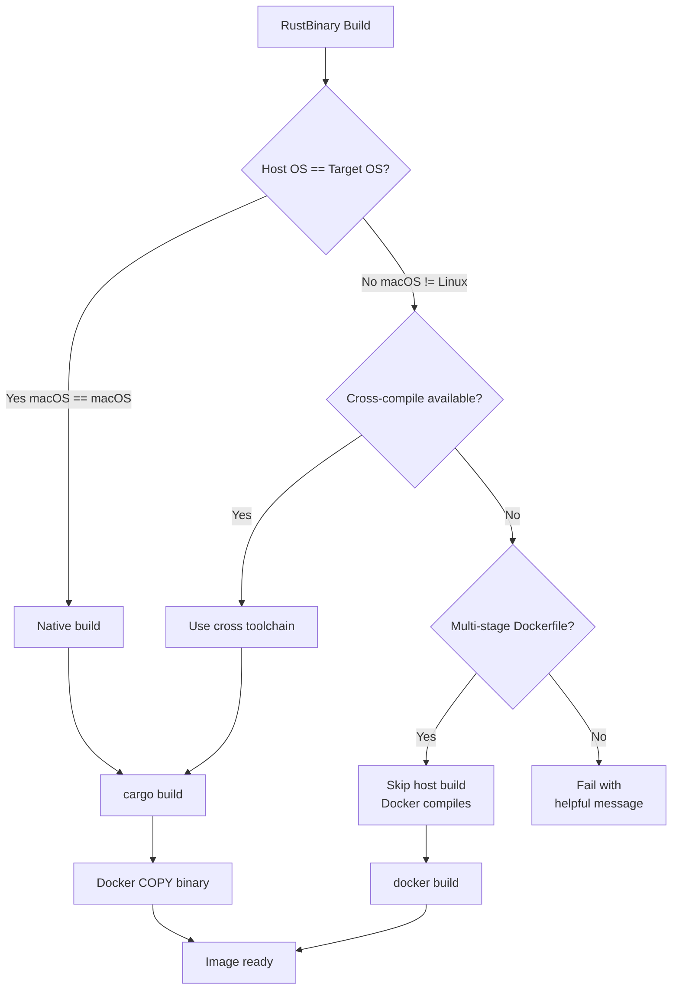

# Plan: Target Architecture Control & Bazel OCI Support

## Overview

This plan covers two major changes to Rush:
1. **Target Architecture Control** - `--arch` flag with native (host) architecture as default
2. **Bazel OCI Support** - Build OCI container images entirely within Bazel using `rules_oci`

---

# Part 1: Target Architecture Control

## Problem Statement

Previously, Rush always cross-compiled Docker images to x86_64 (amd64), even when running on ARM64 hosts (Apple Silicon). This required:
- Installing cross-compilation toolchains
- Slower builds due to emulation
- Unnecessary complexity for local development

## Solution

Rush now:
1. **Defaults to native (host) architecture** - No cross-compilation needed for local dev
2. **Provides `--arch` flag** - For explicit architecture targeting when needed
3. **Provides `--toolchain` flag** - Control cross-compilation toolchain (native or cross-compile)
4. **Relaxed preflight checks** - Rust targets are optional warnings, not hard failures
5. **Helpful error messages** - When cross-compilation toolchain is missing, shows installation instructions

## Changes Made

### 1. CLI Arguments (`rush-cli/src/args.rs`)

```rust
.arg(arg!(target_arch : --arch <TARGET_ARCH> 
    "Target architecture: amd64, arm64, or native (default: native, uses host architecture)"))
.arg(arg!(toolchain : --toolchain <TOOLCHAIN> 
    "Toolchain mode: native (use system tools), or cross-compile target like x86, arm64 (default: matches --arch)"))
```

**Toolchain Options:**
- `native` - Use system tools (clang, gcc) without cross-compilation prefixes
- `x86` / `x86_64` / `amd64` - Use x86_64-unknown-linux-gnu toolchain
- `arm64` / `aarch64` - Use aarch64-unknown-linux-gnu toolchain

**Default Behavior:**
- If `--arch` matches host architecture → toolchain defaults to `native`
- If `--arch` differs from host → toolchain defaults to match `--arch` (cross-compilation)

### 2. Context Builder (`rush-cli/src/context_builder.rs`)

```rust
fn get_target_arch(matches: &ArgMatches) -> String {
    if let Some(target_arch) = matches.get_one::<String>("target_arch") {
        match target_arch.as_str() {
            "native" => std::env::consts::ARCH.to_string(),
            "amd64" | "x86_64" => "x86_64".to_string(),
            "arm64" | "aarch64" => "aarch64".to_string(),
            _ => std::env::consts::ARCH.to_string(),
        }
    } else {
        // Default to native (host) architecture
        std::env::consts::ARCH.to_string()
    }
}
```

### 3. Preflight Checks (`rush-helper/src/checks.rs`)

Made Rust targets optional (warnings instead of errors):

| Check | Before | After |
|-------|--------|-------|
| `wasm32-unknown-unknown` | Required | Optional warning |
| `aarch64-unknown-linux-gnu` | Required | Optional warning |
| `x86_64-unknown-linux-gnu` | Required | Optional warning |
| `trunk` | Required | Optional warning |

This allows:
- Bazel builds to work without installing Rust targets
- Builds to fail gracefully at build time with clear errors

### 4. Build Orchestrator (`rush-container/src/build/orchestrator.rs`)

Bazel components always rebuild (bypass Rush's incremental cache):

```rust
// Bazel components always rebuild - Bazel handles its own caching
let is_bazel = matches!(spec.build_type, BuildType::Bazel { .. });
if !force_rebuild && !is_bazel {
    // Check if image exists...
} else if is_bazel {
    info!("[BUILD DECISION] Component '{}': Bazel component - always rebuilding", ...);
}
```

## Usage

```bash
# Local development (uses host architecture, native toolchain)
rush helloworld.wonop.io dev

# Explicit x86_64 targeting with cross-compilation
rush --arch amd64 helloworld.wonop.io dev

# Explicit x86_64 targeting but use native toolchain (Docker handles cross-compilation)
rush --arch amd64 --toolchain native helloworld.wonop.io dev

# Explicit ARM64 targeting
rush --arch arm64 helloworld.wonop.io dev

# Skip all preflight checks
rush --skip-checks helloworld.wonop.io dev
```

## Error Messages

When a cross-compilation toolchain is missing, Rush now shows helpful instructions:

```
❌ No suitable cross-compilation toolchain found for macOS/aarch64 -> linux/x86_64
   Looking for toolchain: x86_64-unknown-linux-gnu

📦 To install the cross-compilation toolchain, run:
   arch -arm64 brew install SergioBenitez/osxct/x86_64-unknown-linux-gnu
   rustup target add x86_64-unknown-linux-gnu

💡 Alternatively, use --toolchain native to skip cross-compilation
   (Note: This will use host tools, which may not work for all builds)
```

## Architecture Flow



## Files Modified for Target Architecture Control

| File | Change |
|------|--------|
| `rush-cli/src/args.rs` | Added `--arch` and `--toolchain` flags |
| `rush-cli/src/context_builder.rs` | Added `get_toolchain()`, modified `create_toolchain()` to return Result |
| `rush-toolchain/src/context.rs` | Added `try_create_with_platforms()` for fallible toolchain creation |
| `rush-helper/src/checks.rs` | Made Rust targets optional warnings |
| `rush-container/src/build/orchestrator.rs` | Bazel always rebuilds + `ensure_bazelrc()` for macOS toolchain fixes |
| `rush-build/src/build_type.rs` | Added `oci_load_target` to Bazel variant |
| `rush-build/src/spec.rs` | Parse `oci_load_target` from YAML |

---

# Part 2: Bazel-based OCI Images

## Architecture



## Components

### API Server (Rust/Axum)

Multi-architecture OCI image built with:
- `rules_rust` for Rust compilation
- `rules_pkg` for tarball layers
- `rules_oci` for OCI image construction
- Base image: `gcr.io/distroless/cc-debian12`



### Frontend (Yew WASM)

Multi-architecture OCI image with nginx serving static WASM:
- `rust_wasm_bindgen` for WASM/JS generation
- Nginx alpine base image
- Static file layers (HTML, CSS, assets)



---

## Configuration

### stack.spec.yaml

```yaml
frontend:
  build_type: "Bazel"
  location: "frontend/webui"
  # Bazel OCI targets
  oci_image_target: "//src:image"
  oci_load_target: "//src:load"
  oci_push_target: "//src:push"

api-server:
  build_type: "Bazel"
  location: "api-server"
  # Bazel OCI targets
  oci_image_target: "//src:image"
  oci_load_target: "//src:load"
  oci_push_target: "//src:push"
```

### Bazel Targets

| Component | Target | Description |
|-----------|--------|-------------|
| api-server | `//src:api_server` | Rust binary |
| api-server | `//src:image` | Multi-arch OCI image index |
| api-server | `//src:load` | Load image to local Docker |
| api-server | `//src:push` | Push to registry |
| frontend | `//src:webui` | WASM + JS bindings |
| frontend | `//src:image` | Multi-arch OCI image index |
| frontend | `//src:load` | Load image to local Docker |
| frontend | `//src:push` | Push to registry |

---

## File Structure

### API Server

```
api-server/
├── MODULE.bazel              # rules_rust + rules_oci + rules_pkg
├── src/
│   ├── BUILD.bazel           # rust_binary + OCI targets
│   └── main.rs               # Axum server
├── infrastructure/
│   └── deployment.yaml       # K8s manifests
├── Cargo.toml                # IDE support
└── .bazelversion
```

### Frontend

```
frontend/webui/
├── MODULE.bazel              # rules_rust + rules_oci + rules_pkg
├── BUILD.bazel               # Export static files
├── src/
│   ├── BUILD.bazel           # rust_wasm_bindgen + OCI targets
│   ├── main.rs
│   ├── app.rs
│   └── routes.rs
├── index.bazel.html          # HTML for WASM
├── tailwind.css
├── nginx.conf                # Nginx SPA config
├── assets/
├── Cargo.toml                # IDE support
└── .bazelversion
```

---

## Build Commands

### Local Development

```bash
# Build API server binary
cd products/io.wonop.helloworld/api-server
bazel build //src:api_server

# Build frontend WASM
cd products/io.wonop.helloworld/frontend/webui
bazel build //src:webui
```

### Build & Load OCI Images

```bash
# Load api-server image to local Docker
cd api-server
bazel run //src:load
docker run -p 8080:8080 api-server:latest

# Load frontend image to local Docker
cd frontend/webui
bazel run //src:load
docker run -p 80:80 webui:latest
```

### Push to Registry

```bash
# Push api-server (multi-arch)
cd api-server
bazel run //src:push

# Push frontend (multi-arch)
cd frontend/webui
bazel run //src:push
```

---

## Multi-Architecture Support

Both components build for `linux/amd64` and `linux/arm64`:

```starlark
# In MODULE.bazel
oci.pull(
    name = "distroless_cc",
    platforms = [
        "linux/amd64",
        "linux/arm64",
    ],
)
```

The `oci_image_index` creates a manifest list supporting both architectures:

```starlark
oci_image_index(
    name = "image",
    images = [
        ":image_amd64",
        ":image_arm64",
    ],
)
```

Local loads automatically select the host architecture:

```starlark
oci_load(
    name = "load",
    image = select({
        "@platforms//cpu:arm64": ":image_arm64",
        "@platforms//cpu:x86_64": ":image_amd64",
        "//conditions:default": ":image_amd64",
    }),
)
```

---

## Implementation Status

### Completed ✅

- [x] API Server MODULE.bazel with rules_oci
- [x] API Server BUILD.bazel with OCI targets
- [x] API Server main.rs (Axum)
- [x] API Server removed Dockerfile (using Bazel OCI)
- [x] Frontend MODULE.bazel with rules_oci
- [x] Frontend BUILD.bazel with OCI targets
- [x] Frontend nginx.conf for SPA
- [x] Frontend removed Dockerfile.bazel (using Bazel OCI)
- [x] Updated stack.spec.yaml with OCI targets
- [x] Multi-architecture support (amd64 + arm64)
- [x] Test Bazel builds locally on ARM64 (Apple Silicon)
- [x] Update Rush orchestrator to use Bazel OCI targets
- [x] Auto-generate .bazelrc for macOS toolchain fixes

### Pending

- [ ] Integration testing with full stack (Rush → Bazel → Docker → K8s)

---

## Rush Orchestrator Changes (Completed)

The following Rush changes have been implemented:

### 1. BuildType::Bazel Updated (`rush-build/src/build_type.rs`)

Added `oci_load_target` field:
```rust
Bazel {
    location: String,
    output_dir: String,
    context_dir: Option<String>,
    targets: Option<Vec<String>>,
    additional_args: Option<Vec<String>>,
    base_image: Option<String>,
    // NEW: Bazel target for loading OCI image into Docker
    oci_load_target: Option<String>,
}
```

### 2. Spec Parsing Updated (`rush-build/src/spec.rs`)

Now reads `oci_load_target` from stack.spec.yaml.

### 3. Build Orchestrator Updated (`rush-container/src/build/orchestrator.rs`)

New `run_bazel_oci_load` method:
```rust
async fn run_bazel_oci_load(
    &self,
    workspace_path: &Path,
    oci_load_target: &str,
    additional_args: Option<&Vec<String>>,
) -> Result<()>
```

When `oci_load_target` is set, Rush:
- Runs `bazel run <oci_load_target>` instead of `bazel build`
- Skips Dockerfile generation
- Image is loaded directly into Docker by Bazel

### 4. Always Rebuild for Bazel (`rush-container/src/build/incremental.rs`)

Bazel builds always trigger a rebuild:
```rust
if matches!(spec.build_type, BuildType::Bazel { .. }) {
    return Ok(true); // Always rebuild
}
```

This ensures Bazel's own caching is used instead of Rush's incremental build cache.

---

## Benefits of rules_oci

| Feature | Dockerfile | rules_oci |
|---------|-----------|-----------|
| Hermetic builds | No | Yes |
| Cache efficiency | Layer-based | Content-addressed |
| Multi-arch | Buildx required | Native support |
| Reproducibility | Limited | Fully reproducible |
| Build speed | Re-downloads base | Cached base layers |
| No Docker daemon | No | Yes |
| Remote execution | No | Yes |

---

## Bazel Configuration Fixes for ARM64 (February 2026)

The following fixes were required to make Bazel OCI builds work on ARM64 (Apple Silicon):

### 1. Updated rules_rust Version

Updated from `0.56.0` to `0.69.0` for Rust 1.85+ support (required for `edition2024`):

```starlark
# MODULE.bazel
bazel_dep(name = "rules_rust", version = "0.69.0")
bazel_dep(name = "rules_rust_wasm_bindgen", version = "0.69.0")
```

### 2. Multi-Platform Base Image Fixes

Used correct multi-platform manifest list digests (not single-platform digests):

**API Server (distroless/cc-debian12):**
```starlark
oci.pull(
    name = "distroless_cc",
    # Multi-platform manifest list digest
    digest = "sha256:329e54034ce498f9c6b345044e8f530c6691f99e94a92446f68c0adf9baa8464",
    image = "gcr.io/distroless/cc-debian12",
    platforms = [
        "linux/amd64",
        "linux/arm64/v8",  # Note: arm64 requires /v8 variant
    ],
)
```

**Frontend (nginx:alpine):**
```starlark
oci.pull(
    name = "nginx",
    # Multi-platform manifest list digest
    digest = "sha256:1d13701a5f9f3fb01aaa88cef2344d65b6b5bf6b7d9fa4cf0dca557a8d7702ba",
    image = "index.docker.io/library/nginx",
    platforms = [
        "linux/amd64",
        "linux/arm64/v8",  # Note: arm64 requires /v8 variant
    ],
)
```

**Key Insight:** ARM64 images use the `v8` variant (ARMv8 architecture), so platform must be `linux/arm64/v8` not just `linux/arm64`.

### 3. Root BUILD.bazel for API Server

Created `/api-server/BUILD.bazel` - required by rules_rust crate_universe:

```starlark
# Root BUILD.bazel file required by rules_rust crate_universe extension
package(default_visibility = ["//visibility:public"])
```

### 4. API Types Symlink for Frontend

Created symlink to share api_types between Bazel modules:
```bash
ln -s ../../api frontend/webui/api
```

This allows `//api/types:api_types` to resolve within the webui Bazel module.

### 5. Pinned wasm-bindgen Version

Pinned wasm-bindgen to match wasm-bindgen-cli 0.2.105 (bundled with rules_rust_wasm_bindgen 0.69.0):

```starlark
# MODULE.bazel
crate.spec(
    package = "wasm-bindgen",
    version = "=0.2.105",  # Exact version to match CLI
    features = ["serde-serialize"],
)
crate.spec(
    package = "wasm-bindgen-futures",
    version = "=0.4.55",
)
```

### 6. UUID JS Feature for WASM

Added `js` feature to uuid for WASM randomness source:

```starlark
crate.spec(
    package = "uuid",
    version = "1.3",
    features = ["serde", "v4", "js"],  # js feature required for WASM
)
```

### 7. Rust Version Update

Updated to Rust 1.85.0 for edition2024 support:

```starlark
rust.toolchain(
    edition = "2021",
    versions = ["1.85.0"],
    extra_target_triples = ["wasm32-unknown-unknown"],
)
```

### 8. Auto-Generated .bazelrc for macOS Toolchain Issues

Rush now automatically creates `.bazelrc` files for Bazel workspaces on macOS to fix toolchain issues when Homebrew LLVM is installed.

**The Problem:**
When Homebrew LLVM (clang-20) is installed, Bazel may pick it up instead of Apple's clang. This causes errors like:
```
clang-20: error: unable to execute command: Executable "ld" doesn't exist!
```

**The Solution:**
Rush automatically creates `.bazelrc` in each Bazel workspace with:
```bazelrc
# Auto-generated by Rush to fix macOS toolchain issues
# This fixes "ld not found" errors when Homebrew LLVM is installed

# Force use of Apple's clang instead of Homebrew's clang
build --action_env=CC=/usr/bin/clang
build --action_env=CXX=/usr/bin/clang++

# Ensure the linker and docker-credential-desktop can be found
build --action_env=PATH=/usr/local/bin:/usr/bin:/bin:/usr/sbin:/sbin

# Use the Xcode toolchain
build --apple_crosstool_top=@local_config_apple_cc//:toolchain
build --crosstool_top=@local_config_apple_cc//:toolchain
build --host_crosstool_top=@local_config_apple_cc//:toolchain
```

**Implementation:**
Added `ensure_bazelrc()` in `rush-container/src/build/orchestrator.rs` that:
- Creates `.bazelrc` only on macOS
- Skips if `.bazelrc` already exists
- Called before running any Bazel commands

### 9. Bazel Binary Discovery

Rush now automatically finds the bazel/bazelisk binary in common installation locations:

**The Problem:**
When Rush runs Bazel commands, it uses `CommandRunner` which spawns a new process. If bazel isn't in the minimal PATH inherited by the subprocess, the build fails with:
```
No such file or directory (os error 2)
```

**The Solution:**
Added `find_bazel_binary()` in `rush-container/src/build/orchestrator.rs`:

```rust
fn find_bazel_binary() -> Result<String> {
    // First check PATH
    for dir in path.split(':') {
        if Path::new(dir).join("bazel").exists() { return Ok(...); }
        if Path::new(dir).join("bazelisk").exists() { return Ok(...); }
    }
    
    // Check common locations
    let common_paths = [
        "/opt/homebrew/bin/bazel",      // Homebrew on Apple Silicon
        "/opt/homebrew/bin/bazelisk",   // Bazelisk on Apple Silicon
        "/usr/local/bin/bazel",         // Homebrew on Intel Mac / Linux
        "/usr/local/bin/bazelisk",
        "/home/linuxbrew/.linuxbrew/bin/bazel",
        "/usr/bin/bazel",
    ];
    
    for path in common_paths {
        if Path::new(path).exists() { return Ok(path); }
    }
    
    Err("Could not find bazel binary")
}
```

### 10. Image Re-Tagging After Bazel Load

Rush now re-tags Bazel-loaded images to match the expected Rush image naming convention:

**The Problem:**
Bazel `oci_load` rules use hardcoded `repo_tags` (e.g., `["webui:latest"]`), but Rush expects images with product-prefixed names (e.g., `helloworld.wonop.io/frontend:5a17ef71`).

**The Solution:**
Added two functions to `rush-container/src/build/orchestrator.rs`:

1. `parse_oci_load_repo_tag()` - Parses `BUILD.bazel` to find the `repo_tags` value
2. Extended `run_bazel_oci_load()` to re-tag after loading:

```rust
async fn run_bazel_oci_load(
    &self,
    workspace_path: &Path,
    oci_load_target: &str,
    expected_image_name: &str,  // New parameter
    additional_args: Option<&Vec<String>>,
) -> Result<()> {
    // Parse repo_tags from BUILD.bazel
    let bazel_image_tag = Self::parse_oci_load_repo_tag(workspace_path, oci_load_target);
    
    // Run bazel load
    // ...
    
    // Re-tag to expected Rush image name
    if let Some(bazel_tag) = bazel_image_tag {
        // docker tag <bazel_tag> <expected_image_name>
    }
}
```

**Example:**
```
webui:latest → helloworld.wonop.io/frontend:5a17ef71
api-server:latest → helloworld.wonop.io/api-server:d0f40b3c
```

### Environment Prerequisites

For Bazel builds to work, ensure:
1. Docker daemon is running
2. Xcode Command Line Tools installed:
   ```bash
   xcode-select --install
   ```
3. Bazel or Bazelisk installed (Rush will find it automatically)

---

---

## Docker Build Fixes for ARM64 (RustBinary Components)

### Problem

The `RustBinary` build type tries to cross-compile Rust code on the host machine for Linux targets. On ARM64 Macs:
1. The build script tries to run `cargo build --target aarch64-unknown-linux-gnu`
2. This requires cross-compilation toolchains that aren't installed
3. The build fails with `No suitable cross-compilation toolchain found`

### Solution: Multi-Stage Dockerfile with Skip Host Build

When cross-compilation isn't available and a multi-stage Dockerfile is detected, Rush:
1. Skips the host `cargo build` entirely
2. Lets the Dockerfile handle compilation inside Docker

#### Changes Made

**1. BuildContext (`rush-build/src/context.rs`):**
Added `skip_host_build` field:
```rust
/// Skip host cargo build (used for multi-stage Dockerfiles that compile inside Docker)
#[serde(default)]
pub skip_host_build: bool,
```

**2. Build Orchestrator (`rush-container/src/build/orchestrator.rs`):**
Logic to detect when to skip host build:
```rust
let needs_cross_compile = host_platform.os != target_platform.os;
let is_multistage_dockerfile = spec.build_type.dockerfile_path()
    .map(|d| d.to_lowercase().contains("multistage"))
    .unwrap_or(false);
let skip_host_build = needs_cross_compile && !cross_compile_available && is_multistage_dockerfile;
```

**3. Build Script Template (`templates/build/rust_binary.sh`):**
```bash

# Skipping host cargo build - multi-stage Dockerfile will handle compilation
echo "Skipping host cargo build for {{ rust_target }} - compilation will happen inside Docker"

# ... normal cargo build ...

```

**4. Platform Target Fix (`rush-toolchain/src/platform.rs`):**
Fixed `to_rust_target()` to produce correct targets:
```rust
pub fn to_rust_target(&self) -> String {
    match self.os {
        OperatingSystem::Linux => format!("{}-unknown-linux-gnu", self.arch),
        OperatingSystem::MacOS => format!("{}-apple-darwin", self.arch),
    }
}
```

Added `Platform::for_docker()` for Docker container targets:
```rust
pub fn for_docker() -> Self {
    Self {
        os: OperatingSystem::Linux,
        arch: ArchType::default(), // Use native architecture
    }
}
```

**5. Docker Build Platform (`rush-docker/src/client.rs`):**
Fixed `build_image()` to use native platform:
```rust
async fn build_image(&self, tag: &str, dockerfile: &str, context: &str) -> Result<()> {
    let platform = self.target_platform();
    let mut args = vec!["build".to_string()];
    args.push("--platform".to_string());
    args.push(platform.to_string());
    // ...
}
```

#### Multi-Stage Dockerfile Example

The multi-stage Dockerfile compiles inside Docker:

```dockerfile
# backend/Dockerfile.multistage
FROM rust:1.85-bookworm AS builder
WORKDIR /usr/src

# Modify workspace to exclude frontend (backend doesn't need it)
COPY Cargo.toml ./Cargo.toml.orig
RUN sed 's|"frontend/webui",*||g' Cargo.toml.orig > Cargo.toml

# Copy workspace members
COPY api/types ./api/types
COPY backend/server ./backend/server

# Build
RUN cargo build --release -p server

# Runtime image
FROM debian:bookworm-slim
COPY --from=builder /usr/src/target/release/server /server
CMD ["/server"]
```

**Configuration:**
```yaml
# stack.spec.yaml
backend:
  build_type: "RustBinary"
  location: "backend/server"
  context_dir: "../.."  # Use product root for workspace builds
  dockerfile: "backend/Dockerfile.multistage"  # Multi-stage build for ARM64
```

### Architecture Flow



---

## Rollback Plan

To revert to Dockerfile-based builds:

1. Restore Dockerfiles from git history
2. Update stack.spec.yaml:
   ```yaml
   api-server:
     build_type: "Bazel"
     dockerfile: "api-server/Dockerfile"
     # Remove: oci_image_target, oci_load_target, oci_push_target
   ```
3. Comment out OCI targets in BUILD.bazel files
