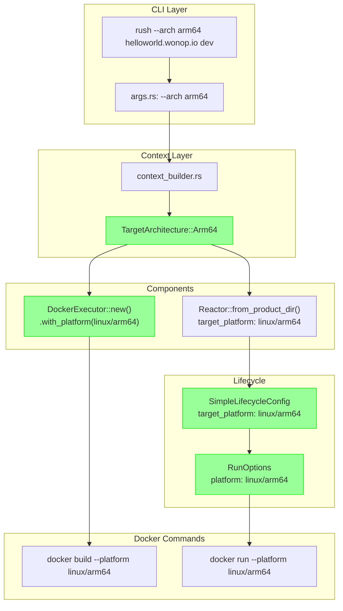

# Plan: Target Architecture Control for Docker Images

## Status: IMPLEMENTED ✓

The `--arch` flag now properly controls the target architecture for all Docker operations.

## Changes Made

### Phase 1: Core Types ✓

**File: `rush-core/src/types.rs`**
- Added `TargetArchitecture` enum with variants: `Native`, `Amd64`, `Arm64`
- Implements `FromStr`, `Display`, `Default`, `Serialize`, `Deserialize`
- Methods: `to_docker_platform()`, `to_rust_target()`, `arch_name()`, `is_native()`, `requires_cross_compilation()`

**File: `rush-core/src/lib.rs`**
- Exported `TargetArchitecture` from the crate

### Phase 2: CLI & Context ✓

**File: `rush-cli/src/context_builder.rs`**
- `get_target_arch()` now returns `TargetArchitecture` instead of `String`
- `DockerExecutor` creation uses `target_arch.to_docker_platform()`
- `create_reactor()` and `create_minimal_reactor()` now accept `&TargetArchitecture`
- Both pass the platform to `Reactor::from_product_dir()`

### Phase 3: Reactor Layer ✓

**File: `rush-container/src/reactor/modular_core.rs`**
- `from_product_dir()` now accepts `target_platform: Option<&str>` parameter
- Sets `modular_config.lifecycle.target_platform` when provided
- Falls back to native platform when not specified

### Phase 4: Lifecycle Manager ✓

**File: `rush-container/src/simple_lifecycle.rs`**
- Added `target_platform: String` field to `SimpleLifecycleConfig`
- `RunOptions` creation now uses `self.config.target_platform.clone()` instead of hardcoded `docker_platform_native()`

### Phase 5: Other Call Sites ✓

**File: `rush-cli/src/commands/dev.rs`**
- Updated `from_product_dir()` call with `None` (uses native platform)

**File: `rush-cli/src/commands/deploy.rs`**
- Updated `from_product_dir()` call with `None` (uses native platform)

## Architecture Flow (After Changes)



## Usage Examples

```bash
# Default: Build for host architecture (native)
rush helloworld.wonop.io dev
# On ARM64 Mac: builds linux/arm64 images
# On x86_64 Linux: builds linux/amd64 images

# Explicit ARM64
rush --arch arm64 helloworld.wonop.io dev
# Always builds linux/arm64 images

# Explicit AMD64 (x86_64)
rush --arch amd64 helloworld.wonop.io dev
# Always builds linux/amd64 images

# Explicit native (same as default)
rush --arch native helloworld.wonop.io dev
```

## Key Files Modified

| File | Change |
|------|--------|
| `rush-core/src/types.rs` | Added `TargetArchitecture` enum |
| `rush-core/src/lib.rs` | Export `TargetArchitecture` |
| `rush-cli/src/context_builder.rs` | Parse CLI, create DockerExecutor with platform, pass to Reactor |
| `rush-container/src/reactor/modular_core.rs` | Accept `target_platform` param, set on lifecycle config |
| `rush-container/src/simple_lifecycle.rs` | Added `target_platform` to config, use in `RunOptions` |
| `rush-cli/src/commands/dev.rs` | Updated `from_product_dir()` call |
| `rush-cli/src/commands/deploy.rs` | Updated `from_product_dir()` call |

## Verification

The build succeeds:
```
Finished `dev` profile [unoptimized + debuginfo] target(s) in 15.06s
```

To verify the architecture is correctly applied:
1. Run `rush --arch arm64 helloworld.wonop.io dev` on any machine
2. Check the Docker build output shows `--platform linux/arm64`
3. Inspect the built image: `docker inspect <image> | grep Architecture`

## Notes

- The `--arch` flag existed before but was not propagated through the system
- Default behavior is now `native` (uses host architecture)
- The `TargetArchitecture` enum provides a type-safe way to handle architectures
- Fallback paths in `dev.rs` and `deploy.rs` use `None` which defaults to native
