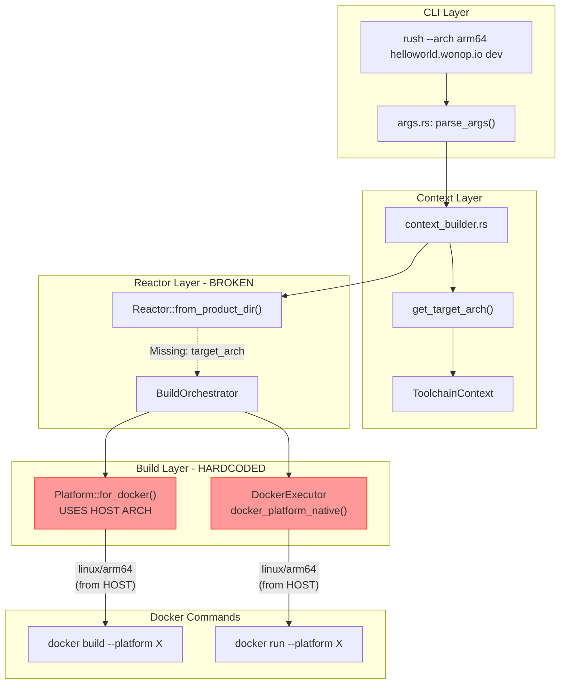
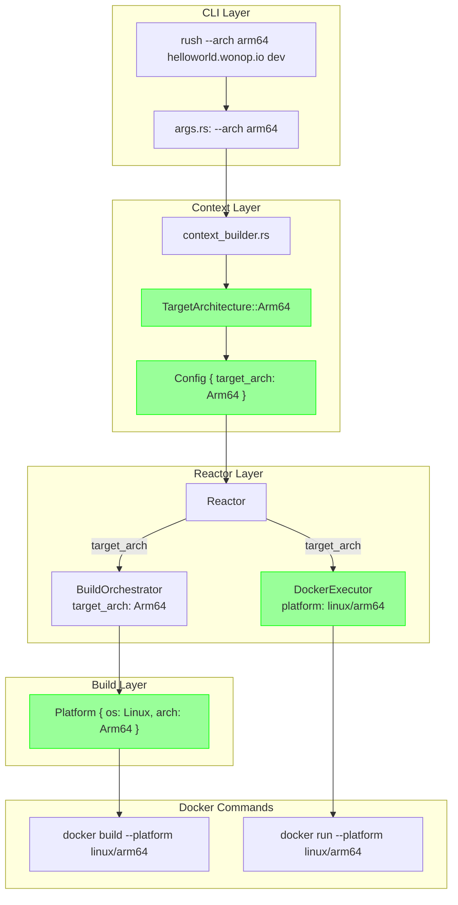

# Plan: Target Architecture Control for Docker Images

## Executive Summary

**Goal:** Implement a `--target-arch` (or `--arch`) flag that controls the architecture of all Docker images Rush builds and runs.

- **Default behavior:** Build for the host machine's architecture (native)
- **Override:** `rush --arch amd64|arm64|native ...` to target a specific architecture

## Current State Analysis

### What Already Exists

1. **CLI flag exists** (`rush-cli/src/args.rs:43`):
   ```rust
   .arg(arg!(target_arch : --arch <TARGET_ARCH> 
       "Target architecture: amd64, arm64, or native (default: native)"))
   ```

2. **Architecture parsing exists** (`rush-cli/src/context_builder.rs:290-309`):
   ```rust
   fn get_target_arch(matches: &ArgMatches) -> String {
       // Parses --arch and defaults to std::env::consts::ARCH
   }
   ```

3. **Platform struct exists** (`rush-toolchain/src/platform.rs`):
   ```rust
   pub struct Platform {
       pub os: OperatingSystem,
       pub arch: ArchType,
   }
   ```

4. **Docker platform constants** (`rush-core/src/constants.rs:67-80`):
   ```rust
   pub fn docker_platform_native() -> &'static str {
       match std::env::consts::ARCH {
           "aarch64" => DOCKER_PLATFORM_LINUX_ARM64,
           _ => DOCKER_PLATFORM_LINUX_AMD64,
       }
   }
   ```

### The Problem: Architecture Not Propagated

The `--arch` flag is parsed but **not propagated** through the system. Here's where the architecture is hardcoded:

| Location | Current Behavior | Problem |
|----------|------------------|---------|
| `DockerExecutor::default()` | Uses `docker_platform_native()` | Ignores CLI flag |
| `BuildOrchestrator::build_component()` | Uses `Platform::for_docker()` | Ignores CLI flag |
| `simple_docker.rs` | Uses `docker_platform_native()` | Ignores CLI flag |
| `simple_lifecycle.rs` | Uses `docker_platform_native()` | Ignores CLI flag |
| `connection_pool.rs` | Uses `docker_platform_native()` | Ignores CLI flag |
| `image_builder.rs` | Uses `Platform::default()` | Ignores CLI flag |

## Architecture Flow Diagram



## Changes Required

### Phase 1: Core Infrastructure (4 files)

#### 1.1 Add TargetArchitecture to Config (`rush-core/src/config.rs` or new file)

Create a shared type that all modules can use:

```rust
/// Target architecture for Docker images
#[derive(Debug, Clone, Copy, PartialEq, Eq)]
pub enum TargetArchitecture {
    Amd64,
    Arm64,
}

impl Default for TargetArchitecture {
    fn default() -> Self {
        // Default to native host architecture
        match std::env::consts::ARCH {
            "aarch64" => Self::Arm64,
            _ => Self::Amd64,
        }
    }
}

impl TargetArchitecture {
    pub fn from_str(s: &str) -> Self {
        match s.to_lowercase().as_str() {
            "native" => Self::default(),
            "arm64" | "aarch64" => Self::Arm64,
            "amd64" | "x86_64" | "x86" => Self::Amd64,
            _ => Self::default(),
        }
    }

    pub fn to_docker_platform(&self) -> &'static str {
        match self {
            Self::Amd64 => "linux/amd64",
            Self::Arm64 => "linux/arm64",
        }
    }

    pub fn to_rust_target(&self) -> &'static str {
        match self {
            Self::Amd64 => "x86_64-unknown-linux-gnu",
            Self::Arm64 => "aarch64-unknown-linux-gnu",
        }
    }
}
```

**File:** `rush-core/src/target_arch.rs` (new file)

#### 1.2 Update constants.rs

```rust
// Add function that takes explicit architecture
pub fn docker_platform_for_target(arch: TargetArchitecture) -> &'static str {
    arch.to_docker_platform()
}
```

**File:** `rush-core/src/constants.rs`

### Phase 2: Context & Config Propagation (3 files)

#### 2.1 Add target_arch to Config

```rust
pub struct Config {
    // ... existing fields ...
    
    /// Target architecture for Docker images
    target_arch: TargetArchitecture,
}

impl Config {
    pub fn target_arch(&self) -> TargetArchitecture {
        self.target_arch
    }
    
    pub fn with_target_arch(mut self, arch: TargetArchitecture) -> Self {
        self.target_arch = arch;
        self
    }
}
```

**File:** `rush-config/src/lib.rs` (or config struct file)

#### 2.2 Update context_builder.rs

```rust
fn create_config(
    root_dir: &str,
    product_name: &str,
    environment: &str,
    docker_registry: &str,
    start_port: u16,
    target_arch: TargetArchitecture,  // NEW PARAMETER
) -> Result<Arc<Config>> {
    let config_loader = ConfigLoader::new(PathBuf::from(root_dir));
    let config = config_loader
        .load_config(product_name, environment, docker_registry, start_port)?
        .with_target_arch(target_arch);  // SET TARGET ARCH
    Ok(config)
}

// In create_context():
let target_arch = TargetArchitecture::from_str(&get_target_arch(matches));
let config = create_config(
    &root_dir,
    &product_name,
    &environment,
    &docker_registry,
    start_port,
    target_arch,  // PASS TO CONFIG
)?;
```

**File:** `rush-cli/src/context_builder.rs`

### Phase 3: Reactor Layer (2 files)

#### 3.1 Update Reactor to use config's target_arch

```rust
impl Reactor {
    pub async fn from_product_dir(...) -> Result<Self> {
        let target_arch = config.target_arch();
        
        // Pass to BuildOrchestrator
        let orchestrator = BuildOrchestrator::new(
            ...,
            target_arch,  // NEW PARAMETER
        );
        
        // Configure DockerExecutor with platform
        let docker_client = DockerExecutor::new()
            .with_platform(target_arch.to_docker_platform());
    }
}
```

**File:** `rush-container/src/reactor/mod.rs`

### Phase 4: Build Orchestrator (1 file)

#### 4.1 Use target_arch in BuildOrchestrator

```rust
pub struct BuildOrchestrator {
    // ... existing fields ...
    target_arch: TargetArchitecture,
}

impl BuildOrchestrator {
    pub fn new(..., target_arch: TargetArchitecture) -> Self {
        Self {
            ...,
            target_arch,
        }
    }

    async fn build_component(...) -> Result<()> {
        // Use target_arch instead of Platform::for_docker()
        let target_platform = Platform::new(
            "linux",
            self.target_arch.to_arch_str(),
        );
        
        // ...
    }
}
```

**File:** `rush-container/src/build/orchestrator.rs`

### Phase 5: Docker Client Layer (5 files)

Update all Docker client implementations to accept and use the target platform:

#### 5.1 DockerExecutor

```rust
impl Default for DockerExecutor {
    fn default() -> Self {
        Self {
            use_sudo: false,
            timeout: 300,
            // DEFAULT to native, but should be overridden by Reactor
            platform: docker_platform_native().to_string(),
        }
    }
}
```

**File:** `rush-docker/src/client.rs` (already correct, just needs proper configuration)

#### 5.2 SimpleDocker

```rust
impl SimpleDocker {
    pub fn new() -> Self {
        Self {
            // Should accept target_arch parameter
            platform: docker_platform_native().to_string(),
        }
    }
    
    pub fn with_platform(mut self, platform: &str) -> Self {
        self.platform = platform.to_string();
        self
    }
}
```

**File:** `rush-container/src/simple_docker.rs`

#### 5.3 Update docker.rs

The `CommandExecutor` struct also needs the platform:

```rust
pub struct CommandExecutor {
    platform: String,
}

impl CommandExecutor {
    pub fn new() -> Self {
        Self {
            platform: docker_platform_native().to_string(),
        }
    }
    
    pub fn with_platform(platform: &str) -> Self {
        Self {
            platform: platform.to_string(),
        }
    }
}
```

**File:** `rush-container/src/docker.rs`

#### 5.4 Update simple_lifecycle.rs

```rust
// Replace:
platform: rush_core::constants::docker_platform_native().to_string(),

// With:
platform: self.target_arch.to_docker_platform().to_string(),
```

**File:** `rush-container/src/simple_lifecycle.rs`

#### 5.5 Update connection_pool.rs

```rust
fn target_platform(&self) -> &str {
    &self.config.platform  // Use configured platform
}
```

**File:** `rush-container/src/docker/connection_pool.rs`

### Phase 6: Image Builder (1 file)

```rust
impl ImageBuilder {
    // Update to use target platform from config
    async fn determine_platform(&self) -> Platform {
        Platform::new(
            "linux",
            self.config.target_arch().to_arch_str(),
        )
    }
}
```

**File:** `rush-container/src/image_builder.rs`

## Summary: Files to Modify

| File | Change |
|------|--------|
| `rush-core/src/target_arch.rs` | **NEW:** Create TargetArchitecture enum |
| `rush-core/src/lib.rs` | Export target_arch module |
| `rush-core/src/constants.rs` | Add `docker_platform_for_target()` |
| `rush-config/src/lib.rs` | Add target_arch field to Config |
| `rush-cli/src/context_builder.rs` | Parse and propagate target_arch |
| `rush-container/src/reactor/mod.rs` | Pass target_arch to orchestrator & docker |
| `rush-container/src/build/orchestrator.rs` | Use target_arch for Platform |
| `rush-container/src/simple_docker.rs` | Use configured platform |
| `rush-container/src/docker.rs` | Use configured platform |
| `rush-container/src/simple_lifecycle.rs` | Use configured platform |
| `rush-container/src/docker/connection_pool.rs` | Use configured platform |
| `rush-container/src/image_builder.rs` | Use target_arch for platform |

## Data Flow After Changes



## Usage Examples

```bash
# Default: Build for host architecture (native)
rush helloworld.wonop.io dev
# On ARM64 Mac: builds linux/arm64 images
# On x86_64 Linux: builds linux/amd64 images

# Explicit ARM64
rush --arch arm64 helloworld.wonop.io dev
# Always builds linux/arm64 images

# Explicit AMD64 (x86_64)
rush --arch amd64 helloworld.wonop.io dev
# Always builds linux/amd64 images

# Explicit native (same as default)
rush --arch native helloworld.wonop.io dev
```

## Verification Checklist

After implementation, verify:

- [ ] `rush helloworld.wonop.io dev` on ARM64 builds arm64 images
- [ ] `rush --arch amd64 helloworld.wonop.io dev` on ARM64 builds amd64 images
- [ ] `rush --arch arm64 helloworld.wonop.io dev` on x86_64 builds arm64 images
- [ ] Docker images are tagged with correct architecture
- [ ] `docker inspect <image>` shows correct Architecture field
- [ ] Bazel builds respect the target architecture
- [ ] RustBinary builds use correct cross-compilation target

## Implementation Order

1. **Core:** Create `TargetArchitecture` enum
2. **Config:** Add to Config struct
3. **CLI:** Update context_builder to set Config.target_arch
4. **Reactor:** Propagate to BuildOrchestrator and DockerExecutor
5. **Build:** Use in orchestrator for Platform selection
6. **Docker:** Ensure all Docker operations use the configured platform
7. **Test:** Verify with different --arch values

## Estimated Effort

- Core & Config changes: 1-2 hours
- Propagation through layers: 2-3 hours  
- Testing & verification: 1-2 hours
- **Total: ~5-7 hours**
