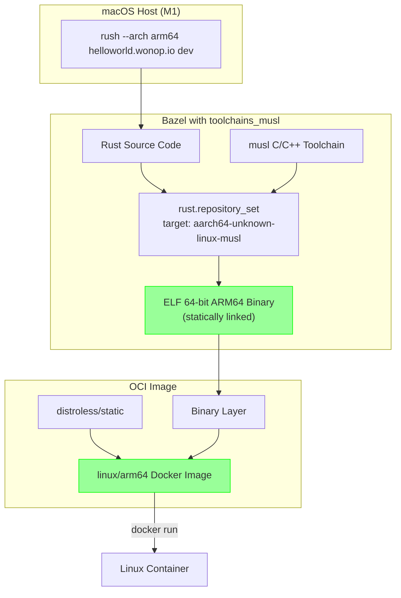

# Plan: Target Architecture Control for Bazel OCI Images

## Status: IMPLEMENTED ✓ (with Cross-Compilation)

**All Docker images are built using Bazel OCI (`rules_oci`) with proper cross-compilation from macOS to Linux.**

## Problem (Solved)

Previously:
1. The `--arch` flag existed but was only partially propagated
2. Bazel OCI builds via `run_bazel_oci_load()` did NOT pass `--platforms=` flag
3. **CRITICAL**: Native Rust binaries were compiled for macOS (Mach-O) instead of Linux (ELF)
4. The resulting Docker images contained macOS binaries that couldn't run in Linux containers

## Root Cause

The original Bazel OCI setup had a fundamental flaw:
- Without cross-compilation toolchains, `rules_rust` compiles for the host OS (macOS)
- Even with `--platforms=//platforms:linux_arm64`, the binary format was still Mach-O
- This is because `--platforms` affects constraint matching, NOT the actual compilation

## Solution: musl Cross-Compilation



## Key Components

### 1. toolchains_musl

The `toolchains_musl` Bazel module provides a GCC-based musl C/C++ toolchain that can cross-compile from:
- macOS ARM64 → Linux ARM64 (musl)
- macOS ARM64 → Linux x86_64 (musl)
- macOS x86_64 → Linux ARM64 (musl)
- macOS x86_64 → Linux x86_64 (musl)

### 2. rust.repository_set()

The `rust.repository_set()` extension configures cross-compilation toolchains:

```starlark
rust.repository_set(
    name = "rust_darwin_aarch64_to_linux_aarch64_musl",
    edition = RUST_EDITION,
    exec_triple = "aarch64-apple-darwin",           # Host
    target_triple = "aarch64-unknown-linux-musl",   # Target
    target_compatible_with = [
        "@platforms//cpu:aarch64",
        "@platforms//os:linux",
    ],
    versions = [RUST_VERSION],
)
```

### 3. Static Linking

With musl, binaries are **statically linked**, meaning:
- No runtime dependency on libc
- Can run on any Linux base image
- `distroless/static` is the ideal minimal base

## Verified Results

**Before (broken):**
```
$ file bazel-bin/src/server
bazel-bin/src/server: Mach-O 64-bit executable arm64
```

**After (working):**
```
$ file bazel-bin/src/server
bazel-bin/src/server: ELF 64-bit LSB executable, ARM aarch64, version 1 (SYSV), statically linked
```

## Changes Made

### Backend MODULE.bazel (Complete)

```starlark
# Platform definitions
bazel_dep(name = "platforms", version = "0.0.11")

# Rust rules
bazel_dep(name = "rules_rust", version = "0.69.0")

# OCI container rules
bazel_dep(name = "rules_oci", version = "2.2.0")

# MUSL toolchain for cross-compilation
bazel_dep(name = "toolchains_musl", version = "0.1.27")

# Register the musl toolchain
toolchains_musl = use_extension("@toolchains_musl//:toolchains_musl.bzl", "toolchains_musl")
toolchains_musl.config()

# Configure Rust toolchains
rust = use_extension("@rules_rust//rust:extensions.bzl", "rust")
rust.toolchain(edition = RUST_EDITION, versions = [RUST_VERSION])

# Cross-compilation: macOS ARM64 -> Linux ARM64 (musl)
rust.repository_set(
    name = "rust_darwin_aarch64_to_linux_aarch64_musl",
    edition = RUST_EDITION,
    exec_triple = "aarch64-apple-darwin",
    target_compatible_with = ["@platforms//cpu:aarch64", "@platforms//os:linux"],
    target_triple = "aarch64-unknown-linux-musl",
    versions = [RUST_VERSION],
)

# ... (additional repository_sets for other arch combinations)
```

### .bazelrc (Required for macOS)

```
# Fix macOS toolchain issues (Homebrew LLVM conflicts)
build --action_env=CC=/usr/bin/clang
build --action_env=CXX=/usr/bin/clang++
build --action_env=PATH=/usr/local/bin:/usr/bin:/bin:/usr/sbin:/sbin

# Use the Xcode toolchain
build --apple_crosstool_top=@local_config_apple_cc//:toolchain
build --crosstool_top=@local_config_apple_cc//:toolchain
build --host_crosstool_top=@local_config_apple_cc//:toolchain
```

### Base Image Selection

For statically linked musl binaries, use `distroless/static`:

```starlark
oci.pull(
    name = "distroless_static",
    digest = "sha256:3f2b64ef97bd285e36132c684e6b2ae8f2723293d09aae046196cca64251acac",
    image = "gcr.io/distroless/static-debian12",
    platforms = ["linux/amd64", "linux/arm64/v8"],
)
```

## Architecture Support Matrix

| Host OS | Host Arch | Target Arch | Target Triple | Works |
|---------|-----------|-------------|---------------|-------|
| macOS | ARM64 (M1/M2) | ARM64 | aarch64-unknown-linux-musl | ✅ |
| macOS | ARM64 (M1/M2) | x86_64 | x86_64-unknown-linux-musl | ✅ |
| macOS | x86_64 | ARM64 | aarch64-unknown-linux-musl | ✅ |
| macOS | x86_64 | x86_64 | x86_64-unknown-linux-musl | ✅ |

## Rush Changes Summary

### Phase 1: Core Types ✓
- `rush-core/src/types.rs`: Added `to_bazel_platform()` method
  - **Bug Fix**: `Native` now returns the appropriate Linux platform based on host CPU
  - Previously returned `None`, which caused Bazel to compile for macOS

### Phase 2: Build Orchestrator ✓
- Added `target_arch` field to `BuildOrchestratorConfig`
- Added `ensure_platforms_build_file()` helper
- Updated `run_bazel_oci_load()` to pass `--platforms=`

### Phase 3: Reactor Integration ✓
- Changed `from_product_dir()` to accept `&TargetArchitecture`

### Phase 4: CLI Updates ✓
- All call sites pass `target_arch` correctly

## Usage

```bash
# Default: Host architecture (native)
rush helloworld.wonop.io dev

# Explicit ARM64 (cross-compile to Linux ARM64)
rush --arch arm64 helloworld.wonop.io dev
# Bazel: --platforms=//platforms:linux_arm64
# Result: ELF 64-bit ARM64 statically linked binary

# Explicit AMD64 (cross-compile to Linux x86_64)
rush --arch amd64 helloworld.wonop.io dev
# Bazel: --platforms=//platforms:linux_amd64
# Result: ELF 64-bit x86_64 statically linked binary
```

## Files Modified

### Rush Core
| File | Change |
|------|--------|
| `rush-core/src/types.rs` | Added `to_bazel_platform()` |
| `rush-container/src/build/orchestrator.rs` | Added `target_arch`, platform flags |
| `rush-container/src/reactor/modular_core.rs` | Pass `target_arch` to build |
| `rush-cli/src/context_builder.rs` | Pass `target_arch` to reactor |

### Backend Bazel Setup (New)
| File | Purpose |
|------|---------|
| `backend/server/MODULE.bazel` | Bazel module with toolchains_musl + rust.repository_set |
| `backend/server/src/BUILD.bazel` | Rust binary + OCI image definitions |
| `backend/server/platforms/BUILD.bazel` | Linux platform definitions |
| `backend/server/.bazelrc` | macOS toolchain fixes |

### stack.spec.yaml
Changed `backend` from `build_type: RustBinary` to `build_type: Bazel` with `oci_load_target`.

## Next Steps

1. **Test full Rush workflow**: Run `rush helloworld.wonop.io dev` to verify containers start correctly
2. **CI/CD**: Ensure `toolchains_musl` works in CI environments
3. **Document `--arch` flag**: Add to user documentation

## Notes

- musl binaries are statically linked (~19MB for the backend)
- `distroless/static` is the minimal base (~2MB)
- First build downloads musl toolchains (~80MB per target)
- Subsequent builds are fully cached by Bazel
