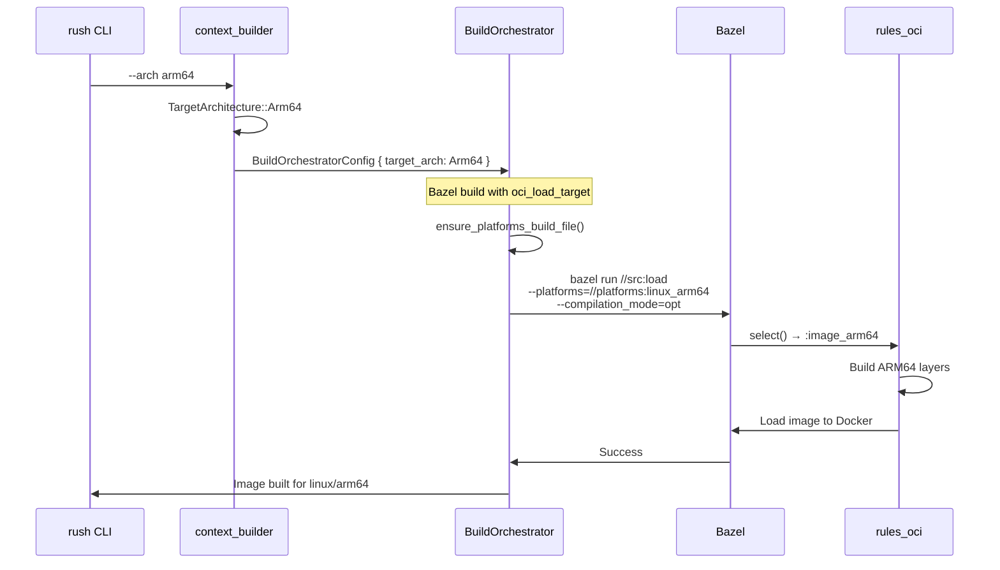

# Plan: Target Architecture Control for Bazel OCI Images

## Status: IMPLEMENTED ✓

**All Docker images are built using Bazel OCI (`rules_oci`), NOT Docker.**

## Problem (Solved)

Previously:
1. The `--arch` flag existed but was only partially propagated
2. Bazel OCI builds via `run_bazel_oci_load()` did NOT pass `--platforms=` flag
3. Bazel defaulted to host architecture, ignoring user's architecture preference
4. The `select()` in BUILD.bazel relied on `--platforms=` to choose the correct image variant

## Solution Implemented

```mermaid
graph TB
    subgraph "CLI"
        CLI["rush --arch arm64 helloworld.wonop.io dev"]
    end
    
    subgraph "Rush"
        TARGET_ARCH["TargetArchitecture::Arm64"]
        BAZEL_CMD["bazel run //src:load<br/>--platforms=//platforms:linux_arm64"]
        CLI --> TARGET_ARCH
        TARGET_ARCH --> BAZEL_CMD
    end
    
    subgraph "BUILD.bazel"
        SELECT["select() chooses :image_arm64"]
        BAZEL_CMD --> SELECT
    end
    
    style TARGET_ARCH fill:#9f9,stroke:#0f0
    style BAZEL_CMD fill:#9f9,stroke:#0f0
```

## Changes Made

### Phase 1: Core Types ✓

**File: `rush-core/src/types.rs`**
- Added `to_bazel_platform()` method to `TargetArchitecture`:
  - `Native` → `None` (uses host platform)
  - `Amd64` → `Some("//platforms:linux_amd64")`
  - `Arm64` → `Some("//platforms:linux_arm64")`

### Phase 2: Build Orchestrator Config ✓

**File: `rush-container/src/build/orchestrator.rs`**
- Added `target_arch: TargetArchitecture` field to `BuildOrchestratorConfig`
- Updated `Default` impl to use `TargetArchitecture::default()` (Native)

### Phase 3: Bazel Platform Definitions ✓

**File: `rush-container/src/build/orchestrator.rs`**
- Added `ensure_platforms_build_file()` helper that auto-generates:
  ```starlark
  # platforms/BUILD.bazel
  platform(name = "linux_amd64", ...)
  platform(name = "linux_arm64", ...)
  ```

### Phase 4: `run_bazel_oci_load` Updated ✓

**File: `rush-container/src/build/orchestrator.rs`**
- Added `target_platform: Option<&str>` parameter
- Passes `--platforms={platform}` flag to Bazel when cross-compiling
- Call site now uses `self.config.target_arch.to_bazel_platform()`

### Phase 5: Reactor Integration ✓

**File: `rush-container/src/reactor/modular_core.rs`**
- Changed `from_product_dir()` signature from `target_platform: Option<&str>` to `target_arch: &TargetArchitecture`
- Sets both:
  - `modular_config.lifecycle.target_platform` (Docker run)
  - `modular_config.build.target_arch` (Bazel build)

### Phase 6: CLI Call Sites Updated ✓

**Files Updated:**
- `rush-cli/src/context_builder.rs` - passes `target_arch` directly
- `rush-cli/src/commands/dev.rs` - uses `&TargetArchitecture::Native`
- `rush-cli/src/commands/deploy.rs` - uses `&TargetArchitecture::Native`

## Architecture Flow



## Usage

```bash
# Default: Native (host architecture)
rush helloworld.wonop.io dev

# Explicit ARM64
rush --arch arm64 helloworld.wonop.io dev
# Bazel runs with: --platforms=//platforms:linux_arm64

# Explicit AMD64
rush --arch amd64 helloworld.wonop.io dev  
# Bazel runs with: --platforms=//platforms:linux_amd64
```

## Files Modified

### Rush Core Changes

| File | Change |
|------|--------|
| `rush-core/src/types.rs` | Added `to_bazel_platform()` method |
| `rush-container/src/build/orchestrator.rs` | Added `target_arch` to config, `ensure_platforms_build_file()`, updated `run_bazel_oci_load()` |
| `rush-container/src/reactor/modular_core.rs` | Changed `from_product_dir()` to accept `&TargetArchitecture` |
| `rush-cli/src/context_builder.rs` | Pass `target_arch` to reactor |
| `rush-cli/src/commands/dev.rs` | Use `&TargetArchitecture::Native` |
| `rush-cli/src/commands/deploy.rs` | Use `&TargetArchitecture::Native` |

### Backend Bazel OCI Setup (New)

The backend component was using Docker build (`Dockerfile.multistage`) and needed to be converted to Bazel OCI:

| File | Change |
|------|--------|
| `products/io.wonop.helloworld/stack.spec.yaml` | Changed `backend` from `build_type: RustBinary` to `build_type: Bazel` with `oci_load_target` |
| `products/io.wonop.helloworld/backend/server/MODULE.bazel` | **NEW** - Bazel module with rules_oci, rules_rust, and crate dependencies |
| `products/io.wonop.helloworld/backend/server/BUILD.bazel` | **NEW** - Root BUILD file |
| `products/io.wonop.helloworld/backend/server/src/BUILD.bazel` | **NEW** - Rust binary + OCI image definitions |
| `products/io.wonop.helloworld/backend/server/platforms/BUILD.bazel` | **NEW** - Platform definitions |
| `products/io.wonop.helloworld/backend/server/.bazelrc` | **NEW** - Bazel config |
| `products/io.wonop.helloworld/backend/server/.bazelversion` | **NEW** - Bazel version |
| `products/io.wonop.helloworld/backend/server/api` | **NEW** - Symlink to `../../api` for shared types |

## Verification

Build succeeds:
```
Finished `dev` profile [unoptimized + debuginfo] target(s) in 11.78s
```

To verify cross-compilation:
1. Run `rush --arch arm64 helloworld.wonop.io dev`
2. Check logs for: `Cross-compiling for platform: //platforms:linux_arm64`
3. Verify Bazel command includes `--platforms=//platforms:linux_arm64`

## Notes

- Platform definitions are auto-generated in `platforms/BUILD.bazel` if missing
- Docker is only used for **running containers locally**, not building images
- All image builds go through Bazel OCI (`rules_oci`)
- The `select()` in BUILD.bazel uses `--platforms=` to choose architecture
