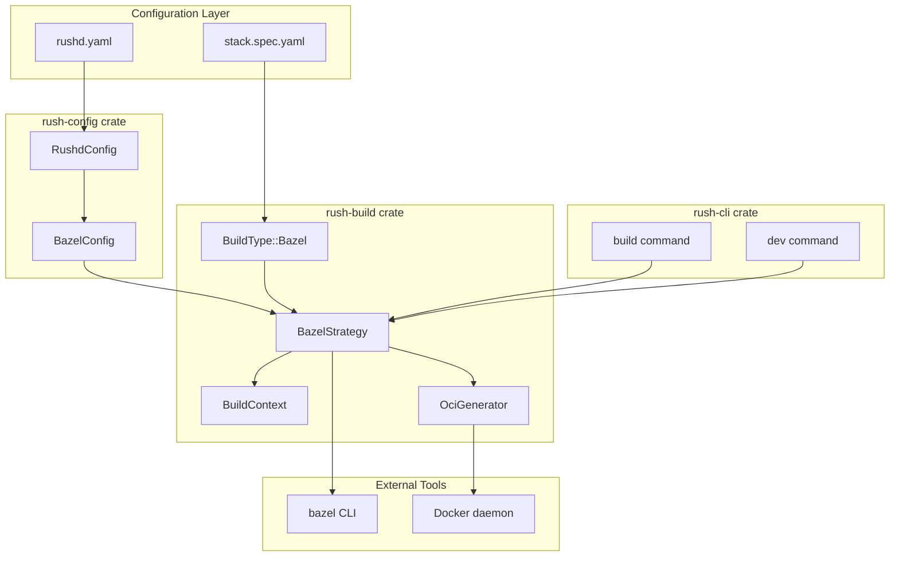
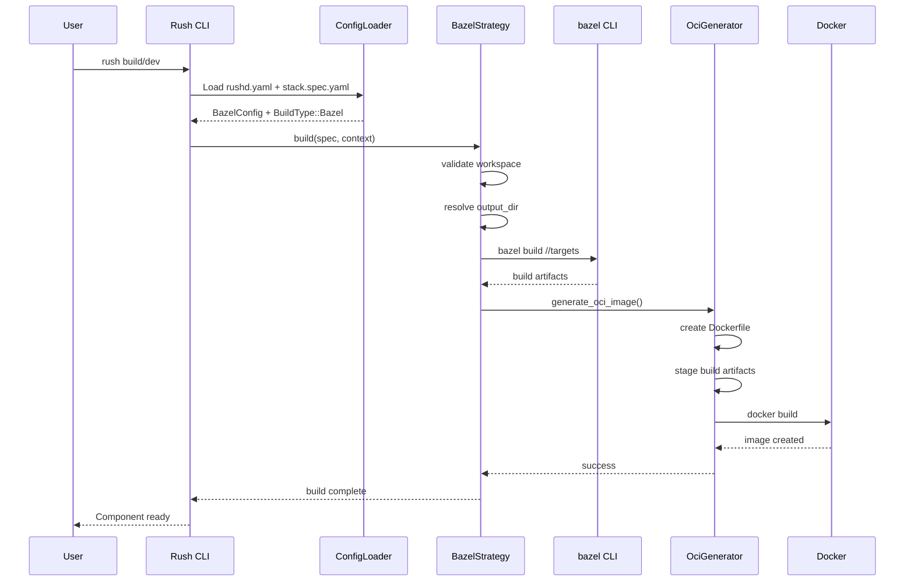
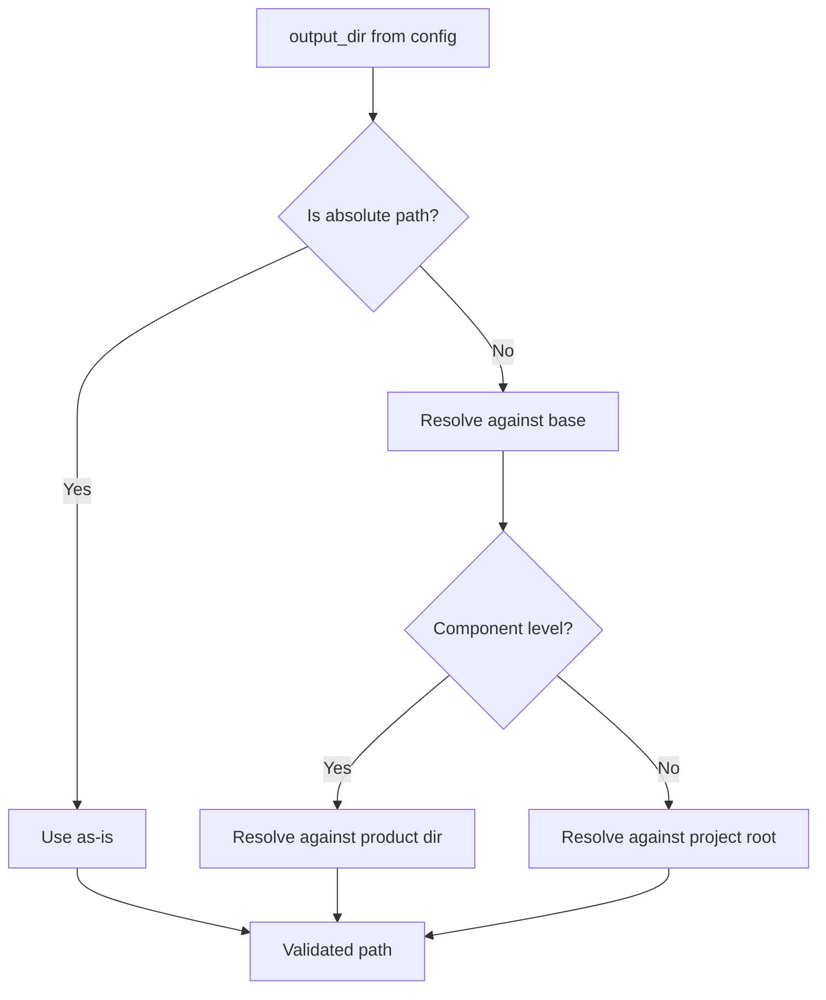

# Bazel Build Integration Architecture

## Overview

This design document describes the architecture for integrating Bazel builds into Rush as a new build target. The integration follows Rush's existing patterns for build strategies while adding specialized handling for Bazel's unique characteristics.

## Architecture Diagrams

### Component Architecture



### Build Flow Sequence



## Detailed Design

### 1. BuildType::Bazel Enum Variant

**Location**: `rush-build/src/build_type.rs`

```rust
/// A Bazel-based build that produces an OCI image
Bazel {
    /// Path to the Bazel workspace directory
    location: String,
    /// Output directory for build artifacts
    output_dir: String,
    /// Optional context directory for Docker build
    context_dir: Option<String>,
    /// Optional list of Bazel targets to build
    targets: Option<Vec<String>>,
    /// Optional additional Bazel arguments
    additional_args: Option<Vec<String>>,
    /// Optional base image for OCI generation
    base_image: Option<String>,
}
```

### 2. BazelStrategy Implementation

**Location**: `rush-build/src/bazel_strategy.rs` (new file)

Key responsibilities:
- Validate Bazel workspace (check for WORKSPACE file)
- Resolve output directory paths (absolute vs relative)
- Execute Bazel build commands
- Invoke OCI image generation
- Handle build errors and output

### 3. OciGenerator Module

**Location**: `rush-build/src/oci_generator.rs` (new file)

Approach: Generate a minimal Dockerfile and use Docker buildx for image creation.

```rust
pub struct OciGenerator {
    base_image: String,
    entrypoint: Option<String>,
    workdir: String,
}

impl OciGenerator {
    pub async fn generate(
        &self,
        build_artifacts: &Path,
        image_name: &str,
    ) -> Result<()>;
}
```

### 4. Configuration Integration

**BazelConfig in rushd.yaml**:
```rust
#[derive(Debug, Deserialize, Serialize, Clone)]
pub struct BazelConfig {
    #[serde(default = "default_bazel_output_dir")]
    pub output_dir: String,
    
    #[serde(default)]
    pub default_base_image: Option<String>,
    
    #[serde(default)]
    pub global_args: Option<Vec<String>>,
}
```

### 5. Path Resolution Strategy



## File Changes Summary

| File | Change Type | Description |
|------|-------------|-------------|
| `rush-build/src/build_type.rs` | Modify | Add `Bazel` variant to `BuildType` enum |
| `rush-build/src/strategy.rs` | Modify | Register `BazelStrategy` in registry |
| `rush-build/src/bazel_strategy.rs` | New | Implement `BazelStrategy` |
| `rush-build/src/oci_generator.rs` | New | OCI image generation from build artifacts |
| `rush-build/src/spec.rs` | Modify | Add "Bazel" case in YAML parsing |
| `rush-build/src/context.rs` | Modify | Ensure BuildContext handles Bazel type |
| `rush-build/src/lib.rs` | Modify | Export new modules |
| `rush-config/src/loader.rs` | Modify | Add `BazelConfig` struct and parsing |
| `rush-container/src/build/orchestrator.rs` | **Modify** | **Add `BuildType::Bazel` case in `build_single` method** |
| `rush-cli/src/commands/build.rs` | Modify | Handle Bazel build type |
| `rush-cli/src/commands/dev.rs` | Modify | Support Bazel in dev mode |
| `rush/src/builder/bazel.rs` | Remove | Delete orphaned code (not part of workspace) |

## Critical Integration Point: BuildOrchestrator

The most critical integration is in `rush-container/src/build/orchestrator.rs`. The `build_single` method (lines 511-715) handles all build types with a match statement. A new arm must be added:

```rust
// In build_single method, add after other BuildType match arms:
BuildType::Bazel {
    location,
    output_dir,
    targets,
    additional_args,
    base_image,
    ..
} => {
    info!("Building Bazel component: {}", spec.component_name);
    
    // 1. Resolve the Bazel workspace path
    let workspace_path = self.config.product_dir.join(location);
    
    // 2. Execute Bazel build
    self.run_bazel_build(&workspace_path, targets.as_deref(), additional_args.as_deref()).await?;
    
    // 3. Resolve output directory and generate Dockerfile
    let output_path = resolve_output_dir(output_dir, &workspace_path);
    let dockerfile_path = self.generate_bazel_dockerfile(&output_path, base_image.as_deref()).await?;
    
    // 4. Build Docker image using standard docker client
    self.docker_client
        .build_image(
            &full_image_name,
            &dockerfile_path.to_string_lossy(),
            &output_path.to_string_lossy(),
        )
        .await?;
    
    info!(
        "Built Bazel component {} in {:?}",
        spec.component_name,
        start_time.elapsed()
    );
    
    Ok(full_image_name)
}
```

This ensures the built image is:
1. Added to `built_images` HashMap 
2. Used by `SimpleLifecycleManager::start_service` to run the container
3. Visible in logs as `[SYSTEM] rush_container | Starting container ...`

## Implementation Phases

### Phase 1: Core Build Infrastructure
1. Add `BuildType::Bazel` variant
2. Implement `BazelStrategy` with basic build execution
3. Add YAML parsing for Bazel components

### Phase 2: OCI Image Generation
1. Implement `OciGenerator` module
2. Integrate with Docker client
3. Add image tagging and naming

### Phase 3: Configuration & CLI Integration
1. Add `BazelConfig` to rushd.yaml
2. Implement path resolution logic
3. Integrate with `rush build` and `rush dev` commands

### Phase 4: Testing & Documentation
1. Unit tests for all new modules
2. Integration tests with demo-bazel example
3. Documentation updates

## Risk Considerations

1. **Bazel Installation**: Users must have Bazel installed; provide clear error messages
2. **Build Performance**: Bazel builds can be slow; leverage Bazel's native caching
3. **Cross-Platform**: Test on macOS and Linux; Windows support may need additional work
4. **OCI Compatibility**: Ensure generated images work with all target registries
