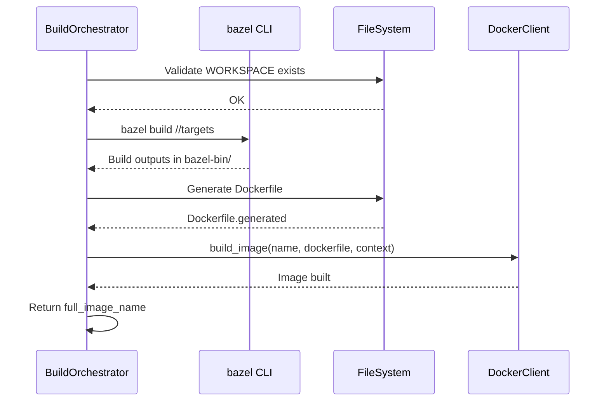

# BuildOrchestrator Bazel Integration Design

## Overview

This design details the specific changes required in `BuildOrchestrator::build_single` to handle `BuildType::Bazel` components, ensuring they are built and their images are properly registered for container startup.

## Current State

The `build_single` method in `rush-container/src/build/orchestrator.rs` (lines 511-715) handles component builds via a match on `build_type`. Currently missing: `BuildType::Bazel`.

## Implementation Approach

### 1. Add Match Arm in build_single

Location: `rush-container/src/build/orchestrator.rs`, after line ~696

```rust
BuildType::Bazel {
    location,
    output_dir,
    targets,
    additional_args,
    base_image,
    context_dir,
} => {
    info!("Building Bazel component: {}", spec.component_name);
    
    // Resolve workspace path
    let workspace_path = self.config.product_dir.join(location);
    
    // Validate workspace exists
    if !workspace_path.join("WORKSPACE").exists() 
        && !workspace_path.join("WORKSPACE.bazel").exists() 
    {
        return Err(Error::Build(format!(
            "No WORKSPACE file found in {}",
            workspace_path.display()
        )));
    }
    
    // Execute Bazel build
    let bazel_result = self.run_bazel_build(
        &workspace_path,
        targets.as_ref(),
        additional_args.as_ref(),
    ).await?;
    
    // Resolve output directory
    let output_path = if Path::new(output_dir).is_absolute() {
        PathBuf::from(output_dir)
    } else {
        workspace_path.join(output_dir)
    };
    
    // Generate Dockerfile for OCI image
    let dockerfile_path = self.generate_bazel_dockerfile(
        &output_path,
        base_image.as_deref(),
    ).await?;
    
    // Build Docker image
    self.docker_client
        .build_image(
            &full_image_name,
            &dockerfile_path.to_string_lossy(),
            &output_path.to_string_lossy(),
        )
        .await?;
    
    info!(
        "Built Bazel component {} in {:?}",
        spec.component_name,
        start_time.elapsed()
    );
    
    Ok(full_image_name)
}
```

### 2. Add Helper Method: run_bazel_build

```rust
/// Execute Bazel build command in the workspace
async fn run_bazel_build(
    &self,
    workspace_path: &Path,
    targets: Option<&Vec<String>>,
    additional_args: Option<&Vec<String>>,
) -> Result<()> {
    use rush_utils::{CommandConfig, CommandRunner};
    
    let mut args = vec!["build".to_string()];
    
    // Add targets or default to all
    if let Some(t) = targets {
        args.extend(t.clone());
    } else {
        args.push("//...".to_string());
    }
    
    // Add compilation mode
    args.push("--compilation_mode=opt".to_string());
    
    // Add additional arguments
    if let Some(extra) = additional_args {
        args.extend(extra.clone());
    }
    
    let config = CommandConfig::new("bazel")
        .args(args.iter().map(|s| s.as_str()).collect())
        .working_dir(workspace_path.to_str().unwrap())
        .capture(true);
    
    let output = CommandRunner::run(config).await
        .map_err(|e| Error::Build(format!("Bazel execution failed: {}", e)))?;
    
    if !output.success() {
        return Err(Error::Build(format!(
            "Bazel build failed:\n{}",
            output.stderr
        )));
    }
    
    Ok(())
}
```

### 3. Add Helper Method: generate_bazel_dockerfile

```rust
/// Generate a Dockerfile for Bazel build outputs
async fn generate_bazel_dockerfile(
    &self,
    output_path: &Path,
    base_image: Option<&str>,
) -> Result<PathBuf> {
    let base = base_image.unwrap_or("scratch");
    
    let dockerfile_content = format!(
        r#"FROM {}
COPY bazel-bin/ /app/
WORKDIR /app
"#,
        base
    );
    
    let dockerfile_path = output_path.join("Dockerfile.generated");
    tokio::fs::write(&dockerfile_path, dockerfile_content).await
        .map_err(|e| Error::Build(format!("Failed to write Dockerfile: {}", e)))?;
    
    Ok(dockerfile_path)
}
```

## Data Flow



## Error Handling

| Scenario | Error Type | Message |
|----------|------------|---------|
| Missing WORKSPACE | `Error::Build` | "No WORKSPACE file found in {path}" |
| Bazel not installed | `Error::Build` | "Bazel execution failed: command not found" |
| Build failure | `Error::Build` | "Bazel build failed:\n{stderr}" |
| Dockerfile write fail | `Error::Build` | "Failed to write Dockerfile: {error}" |
| Docker build fail | `Error::Docker` | Propagated from docker_client |

## Testing Strategy

Integration test with demo-bazel component:
1. Add demo-bazel to stack.spec.yaml
2. Run `rush build`
3. Verify image exists: `docker images | grep demo-bazel`
4. Run `rush dev`
5. Verify container starts in logs
